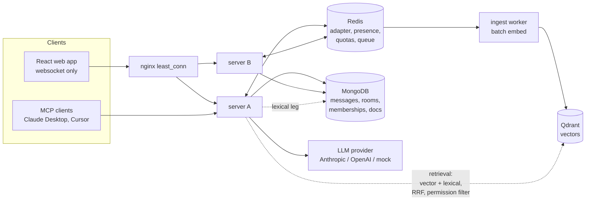

<p align="center">
  
</p>

Parley is a realtime team messenger whose memory is the product: everything your team has ever said or shared becomes a permission-aware knowledge base that answers questions with citations you can click.


## The problem

Scrollback is a graveyard. Decisions get made in passing, then buried under three days of messages. The person who knows is asleep in another timezone. Search finds words, not answers, and new teammates inherit none of it.

## The insight

A chat app already holds the team's collective memory; it just cannot answer for it. Parley embeds every message and document as it arrives, retrieves with current-membership permissions at query time, and answers questions with inline citations that jump back to the exact source message, highlighter sweep included. If the history does not contain the answer, it says so instead of guessing.

## Three features

1. **Recall in the room.** Type `@recall what did we decide about the launch date?` and a cited answer streams into the conversation for everyone, persisted like any other message. Each citation chip previews on hover and jumps on click.
2. **Catch me up.** Come back to 40 unread messages and one pill turns them into a cited digest of what happened and what was decided, scoped to exactly what you missed.
3. **Ask anything.** Cmd+K asks across every room you belong to, privately. Extract decisions on demand per room, graded answers feed the eval set, and a per-room switch turns memory off entirely.

## Architecture



Messages persist to MongoDB, then a BullMQ worker batch-embeds them into Qdrant. A question runs both retrieval legs (vector and lexical) filtered by the asker's current room memberships, fuses them with reciprocal rank fusion, packs the strongest sources into a token budget, and streams a cited answer over the same socket layer that carries chat. The full decision log lives in [docs/ARCHITECTURE.md](docs/ARCHITECTURE.md).

## Live stats

A deployed instance feeds these badges from its public `GET /stats` endpoint (aggregate totals only, never content). Point them at your deployment:

```markdown


```

## Measured numbers

Every number comes from a script in this repo; rerun them yourself. Methods and caveats: [LOADTEST.md](docs/LOADTEST.md), [EVALS.md](docs/EVALS.md).

| What                                                 | Result                 | Source                               |
| ---------------------------------------------------- | ---------------------- | ------------------------------------ |
| Concurrent websocket clients sustained               | 1,000                  | `k6 run infra/loadtest/chat-load.js` |
| Message delivery latency                             | p50 2ms, p95 19ms      | same run                             |
| Retrieval recall@5 on the 30-question golden set     | 96.7%                  | `pnpm ai:eval`                       |
| Retrieval MRR                                        | 0.859                  | `pnpm ai:eval`                       |
| AI pipeline overhead (without provider time)         | p50 54ms, p95 90ms     | `pnpm ai:metrics`                    |
| Integration tests, all green with zero API keys      | 74                     | `pnpm test`                          |
| Chaos: SIGKILL one of two instances mid-conversation | zero loss, 15ms resync | `pnpm chaos`                         |

## Security and privacy stance

- Permission is evaluated when the query runs, not when content was indexed: leave a room and its knowledge leaves you, including caches.
- Retrieved content is treated as untrusted data: delimiter-wrapped sources, a hardened system prompt, no tools, no actions, markdown rendered without raw HTML. Threat model in [ARCHITECTURE.md](docs/ARCHITECTURE.md).
- Per-room memory switch: when off, nothing from that room is embedded, retrieved, or sent to a model.
- Cost as a control surface: daily per-user token quotas, context budgets, batch embedding, and a provider circuit breaker.
- argon2id passwords, short-lived access JWTs, rotating httpOnly refresh cookies, sender identity only ever from the authenticated socket.
- Not end to end encrypted, on purpose: the server must read content to embed it. The tension and a future client-side design are discussed honestly in ARCHITECTURE.md.

## Quickstart

Prerequisites: Node 20+, pnpm (`corepack enable`), Docker.

```bash
pnpm install
docker compose up -d        # mongo, redis, qdrant
cp .env.example .env && pnpm seed:demo && pnpm dev
```

Open http://localhost:5173, sign in as `demo / demo-password-1`, open `#launch-week`, and click the Catch me up pill. Ask the suggested questions with cmd+k; click any citation and watch the jump. The default config uses the deterministic mock provider, no keys needed. Real providers: set `AI_CHAT_PROVIDER=anthropic` with `ANTHROPIC_API_KEY`, or `openai` for both chat and embeddings.

## Deployment

For a live deployment on Netlify (frontend) + Railway (backend) + managed databases:
see [DEPLOYMENT.md](DEPLOYMENT.md). It documents the exact Netlify/Railway/MongoDB Atlas
wiring, common gotchas, and health checks.

## Data Analytics

A separate Python/Spark/Snowflake analytics pipeline reads from the same MongoDB,
answering questions about AI token spend, answer quality, room engagement, and user cohorts.
See [data-pipeline/README.md](data-pipeline/README.md).

## Project Structure

```
apps/
  server/           Node.js + Express. API, websocket, AI layer, ingest worker.
  web/              React + Vite. Single-page app, compiled to static HTML/JS.
  mcp/              Model Context Protocol server for Claude Desktop / Cursor.
packages/
  shared/           TypeScript types, schemas, constants. Monorepo-wide.
data-pipeline/      Python ETL → Spark transform → Snowflake/DuckDB warehouse.
docs/               Architecture, design, evals, load test, product specs.
infra/              Load test, chaos test, lighthouse audit, nginx config.
```

## Use your team's memory from Claude Desktop or Cursor

Parley ships an MCP server (`apps/mcp`) exposing three read-only tools: `search_memory`, `ask_memory`, and `catch_me_up`. They authenticate with a personal access token (create one from the key icon in the sidebar footer) and enforce the exact same query-time permission filters as the app: your token sees precisely the rooms you see, and revoking it or leaving a room takes effect on the next request.

```json
{
  "mcpServers": {
    "parley-memory": {
      "command": "pnpm",
      "args": ["--dir", "/path/to/parley/apps/mcp", "start"],
      "env": {
        "PARLEY_URL": "http://localhost:4000",
        "PARLEY_TOKEN": "pat_your_token_here"
      }
    }
  }
}
```

Then ask Claude things like "search our team memory for the checkout outage root cause" or "catch me up on launch-week".

## Roadmap

- Real-provider eval baseline and the rerank decision it justifies
- Sentence-window chunking for short documents
- Direct messages, message edit and delete with re-embedding
- Presence expiry push via Redis keyspace notifications
- Workspace-level roles and an admin view of the memory switch
