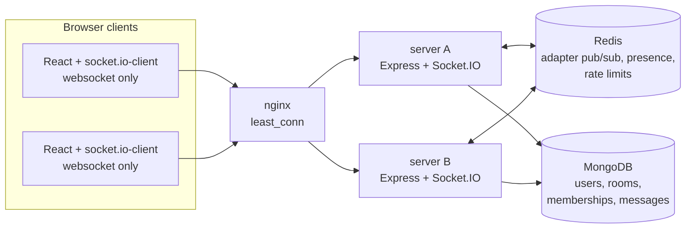

# Parley

Fast, focused team chat: a production-grade realtime messaging app with delivery receipts, presence, and horizontal scaling, built as a flagship portfolio project.

<!-- demo gif placeholder: record with cmd+shift+5 on macOS (select region, record,
     stop from the menu bar), convert to gif (e.g. with gifski or ezgif.com),
     save as docs/demo.gif, then replace this comment with:
      -->

> Demo GIF pending. See the comment above for recording instructions.

## Features

- Realtime messaging over websockets with server-acked sends and optimistic UI
- Delivery states on every own message: sending, sent, delivered, read
- Read receipts via forward-only cursors, per-room unread counts derived from them
- Presence with multi-tab support: no flicker when one of several tabs closes
- Typing indicators, debounced client-side, expired server-side after 3 seconds
- Reconnect sync: missed messages replayed exactly, capped, with a refetch fallback
- Idempotent sends: retries can never duplicate a message
- Sliding-window rate limits in Redis with temporary mutes, per user and per IP
- Cursor-paginated history with matching compound indexes, no unbounded queries
- Horizontal scaling through the Socket.IO Redis adapter, demonstrated by tests
- Dark-first design system, Lighthouse accessibility 100 on both screens

## Architecture



Clients connect with `transports: ['websocket']` only, so any instance can serve any connection and nginx needs no sticky sessions. Room broadcasts fan out across instances through the Redis adapter. MongoDB holds the durable state with indexes matched to every query pattern, and read state lives as a single cursor per membership rather than per-message arrays. Presence is a Redis TTL key per user with a connection count, refreshed by a heartbeat, so a crashed instance can never strand anyone as permanently online. The full decision log, with rejected alternatives, is in [docs/ARCHITECTURE.md](docs/ARCHITECTURE.md).

## Quickstart

Prerequisites: Node 20+, pnpm (via `corepack enable`), Docker.

```bash
pnpm install
docker compose up -d
cp .env.example .env && pnpm dev
```

Open http://localhost:5173, create an account, and you are chatting in #general. The API runs on http://localhost:4000. The example env values boot fine for local development; generate real secrets with `openssl rand -hex 32` before deploying anything.

## Stack and rationale

| Choice                            | Why                                                                              |
| --------------------------------- | -------------------------------------------------------------------------------- |
| TypeScript strict, ESM everywhere | Errors at compile time, no `any` without a written justification                 |
| Express 5 + Socket.IO 4           | Rooms, acks, and reconnection handled by a battle-tested layer over raw ws       |
| MongoDB + Mongoose 8              | Append-heavy message log with cursor pagination maps cleanly to compound indexes |
| Redis (ioredis)                   | One dependency covers adapter pub/sub, presence TTLs, and atomic rate limiting   |
| React 18 + Vite + Tailwind 4      | Fast iteration, design tokens as CSS variables, no runtime CSS cost              |
| react-virtuoso                    | Virtualized message list that stays anchored to the bottom without layout shift  |
| zod in a shared package           | One schema validates on the server and types both sides of the wire              |
| pnpm workspaces                   | Server, web, and shared contracts in one repo with strict dependency boundaries  |

## Measured performance

Single instance on an Apple M3 (8 GB), load generator on the same host, websocket transport. Full method and caveats in [docs/LOADTEST.md](docs/LOADTEST.md).

- 1,000 concurrent websocket clients sustained
- Message ack latency: p50 3 ms, p95 19 ms
- Broadcast delivery latency: p50 2 ms, p95 19 ms
- 834,700 message deliveries at about 4,400/s, zero errors
- Server peak RSS 336 MB

## Security posture

- argon2id password hashing, never anything weaker
- Short-lived access JWT in memory only; rotating refresh JWT in an httpOnly cookie scoped to `/auth`
- Sender identity comes exclusively from the authenticated socket. Payload schemas strip unknown keys, so a forged senderId never reaches a handler
- Every HTTP route and every socket event validated with zod; every handler acked and error-wrapped
- helmet on, CORS locked to the single frontend origin with credentials
- Rate limiting at four layers: auth requests, socket connections per IP, messages per user, room joins per user
- No secrets in the repo or its history; env validated at boot, the server refuses to start otherwise

## Testing

37 integration tests across 7 files run the real stack (Mongo, Redis, live sockets): auth flows, socket handshake rejection, two-client message exchange, forged-sender rejection, idempotent dedup, delivery and read receipts, typing exclusion and expiry, multi-tab presence, reconnect sync, pagination walks, rate-limit mutes and recovery, and cross-instance delivery through the Redis adapter.

```bash
pnpm test          # requires mongo and redis (docker compose up -d)
pnpm lint && pnpm typecheck
```

CI runs lint, format check, typecheck, tests, and builds on every push.

## Roadmap

- Direct messages (the data model already carries `isDM`)
- Message editing and deletion with tombstones
- Full-text search over message history
- File and image attachments
- End-to-end browser tests (Playwright)
- Presence expiry push via Redis keyspace notifications instead of TTL-only
